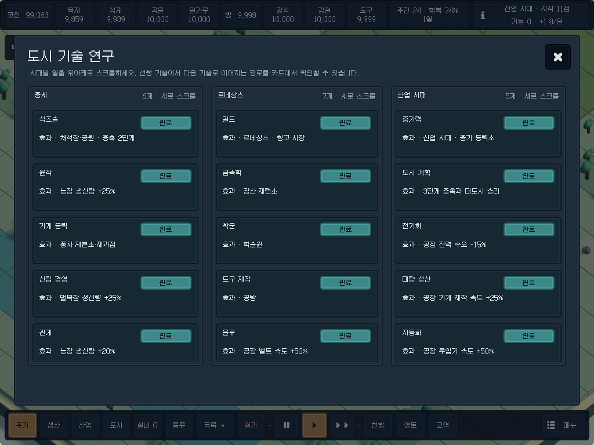
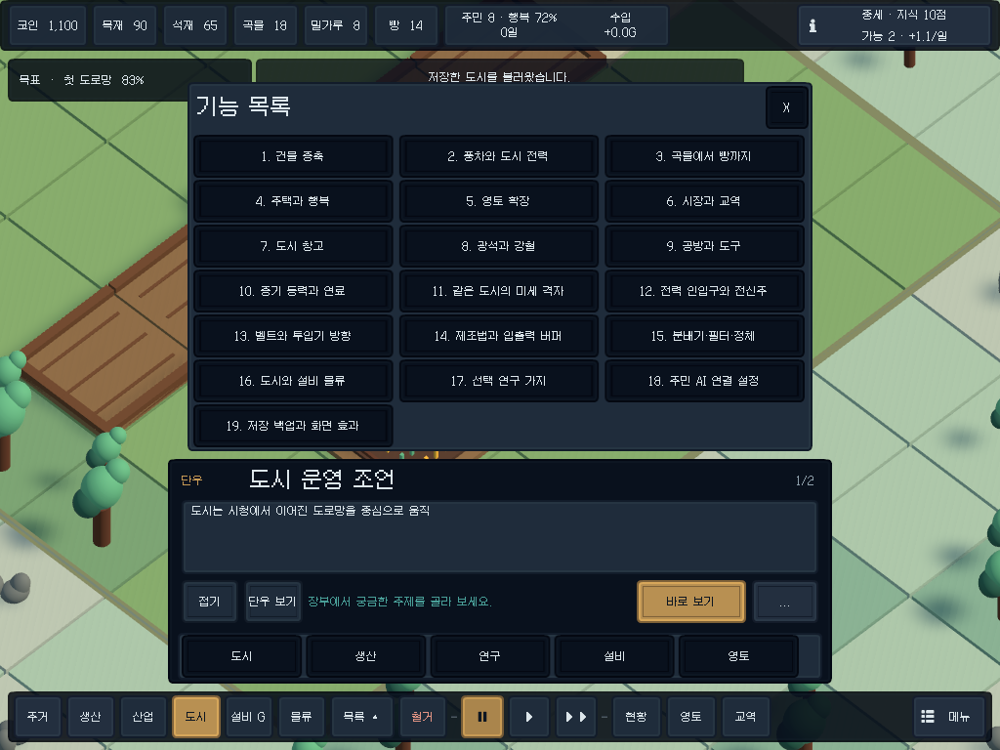

# v0.6.2 UI 다듬기

코드로 생성하는 uGUI 안에서 화면 잘림, 겹침, 정보 표시와 조작을 정리했다. 저장 형식 v4, 도시·물류 시뮬레이션, 주민 행동과 외부 AI 통신 계약은 유지한다. 새 UI 패키지나 이미지 에셋은 추가하지 않았다.

## 적용 내용

| 영역 | 바뀐 동작 |
|---|---|
| 연구 | 상단 60px·하단 68px 여백과 최대 폭 1180px. 시대별 세로 스크롤과 좁은 화면의 가로 스크롤. 연구 가능한 카드를 먼저 표시하고 완료 카드는 효과 한 줄만 남긴다. |
| 공통 스타일 | `HudStyle` 색상·11px 본문·22px 제목·정수 Canvas 배율. 가짜 굵기를 제거하고 선택·확인·위험 색을 구분한다. 닫기는 44px 영역을 사용한다. |
| 하단 도구 | 여섯 분류를 유지하고 건설·시간·도시 기능을 구분한다. 정지·재생 아이콘, 목록 접기와 선택한 도구의 비용을 표시한다. |
| 자원 | 광석·강철·도구는 해금·건설·보유 후 표시하고 현재 도시에서 유지한다. 인구도 칩에 넣고 적자는 위험 색으로 표시한다. 연구 버튼은 오른쪽에 고정한다. |
| 건설 목록 | 내용에 맞는 폭, 전체 잠금 사유, 마우스 호버와 0.45초 길게 누르기 툴팁. 길게 누른 뒤 떼어도 건설 도구를 잘못 선택하지 않는다. |
| 선택 정보 | 상태·생산/제조법·레벨·관련 전력·지형/좌표를 두 열로 정리한다. 긴 행은 세로 스크롤하며 주택에는 전력 행을 표시하지 않는다. |
| 설비 구성 | 호환되는 제조법만 빈칸 없이 정렬하고 필터·재고 투입을 격자로 배치한다. 활성 내용에 맞춰 창 높이를 조절한다. |
| 교역·영토 | 보유 코인과 물자 재고, 구매·판매 가능 여부를 표시한다. 영토는 인접 필요와 코인 부족을 구분한다. |
| 단우 | 실제 텍스트 렌더 높이로 페이지를 나누고 건설 막대 위로 대화창을 올린다. 부가 기능은 더보기에 모으고 기능 목록은 별도 닫기 버튼을 갖는다. |
| 주민 AI | 중복된 상태 문구를 없애고 입력 라벨·고정 헤더·작은 화면의 본문 스크롤을 정리한다. |

주거와 도시 탭은 합치지 않았다. 미사용 `FactoryHud`와 `Hud.AddClick`은 삭제했고 둥근 패널의 대체 스프라이트는 유지한다.

## 화면 검증

Windows 실행 파일 안에서 카메라와 uGUI를 정확한 크기의 RenderTexture에 렌더링한다. 실제 EventSystem 레이캐스트로 버튼·스크롤·월드 입력 차단을 확인하며, 텍스트의 렌더 폭·높이와 마스크 경계도 검사한다. 이는 물리 모니터 크기나 Android 실기기 조작의 증거가 아니다.

| 렌더 해상도 | 기본 화면 입력 차단 | 선택 정보 표시 시 입력 차단 |
|---|---|---|
| 1600×900 | 126/960 · 13.13% | 161/960 · 16.77% |
| 1280×720 | 168/960 · 17.50% | 231/960 · 24.06% |
| 1024×768 | 170/960 · 17.71% | 236/960 · 24.58% |
| 2048×1536 | 85/960 · 8.85% | 103/960 · 10.73% |

각 화면의 40×24개 지점을 검사했다. 기본 화면 20%, 선택 화면 30% 한도를 모두 만족한다. 모달 창은 의도적으로 전체 월드 입력을 차단하므로 이 비율에 포함하지 않는다.

일반 캡처는 0.3초 이상의 등장 연출 대기 후 저장한다. 단우의 인트로·타이핑 연속 프레임은 움직임 자체를 기록하는 예외다. 기본 대사 11개와 기능 안내 19개의 모든 페이지를 네 크기에서 실측하며, 기능 목록의 19개 항목과 더보기·닫기도 확인한다.

작업 전후 화면은 로컬 `Artifacts/UiPolish/before`와 `Artifacts/UiPolish/after`에 각 40장씩 보관한다. 이전 화면은 비교용 캡처이며 새 레이아웃 검사에 통과했다는 의미가 아니다. 빌드 GUID, 최종 실행 결과와 재현 명령은 [검증 기록](VERIFICATION.md)에 있다.
