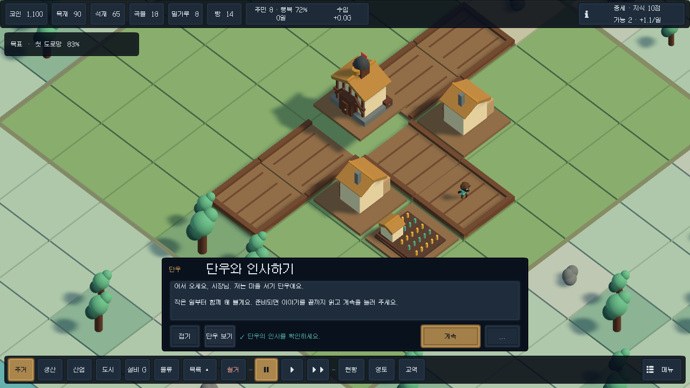
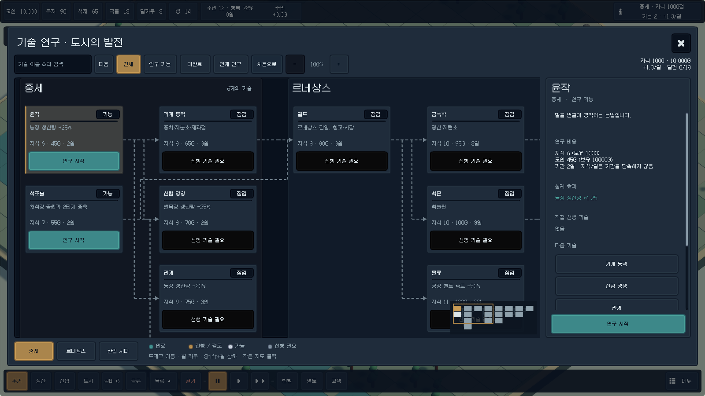

# RIVERWORKS

RIVERWORKS는 모노폴리 보드처럼 나뉜 영토 위에서 도시와 실제 물류 설비를 함께 건설하는 3D 도시 건설 게임입니다. 중세 정착지에서 시작해 도로와 생산망을 잇고, 기술을 연구해 르네상스와 산업 시대로 발전합니다.

현재 소스는 **v0.7.0 연결형 연구·도시 프로토타입**입니다. 건물, 주민, 도로, 벨트와 기계가 같은 21×21 도시와 같은 카메라를 사용합니다. 로우폴리 주민의 작업 동작, 컴팩트 HUD, Feel 피드백, 시청 도착 연출, 실제 주민 단우의 안내와 선택형 OpenRouter 주민 의사결정을 제공합니다.

**플레이하려면 [최신 GitHub Release](https://github.com/atozuser0224/riverworks-city/releases/latest)에서 Windows ZIP을 받아 전체 압축을 풀고 `Riverworks.exe`를 실행하세요.** Unity 설치 없이 플레이할 수 있습니다. 주민 AI 게이트웨이는 별도의 선택 기능입니다. 이번 릴리스는 Windows용이며 Android 기기 검증은 완료하지 않았습니다.



## Unity에서 실행하기

- 소스를 재빌드하려면 [Feel 5.6.1 설치 안내](Docs/FEEL_SETUP.ko.md)에 따라 본인이 보유한 패키지를 먼저 설치합니다. 상용 Feel 원본은 공개 저장소에 포함하지 않습니다.
- Unity Hub에 이 저장소 폴더를 추가합니다.
- Unity **6000.5.5f1**로 프로젝트를 엽니다.
- [Assets/Scenes/Riverworks.unity](Assets/Scenes/Riverworks.unity)을 열고 Play를 누릅니다.
- Windows 빌드는 Unity 메뉴 `Riverworks > Build Windows game`으로 만듭니다.
- Android 설정과 빌드 명령은 [모바일 빌드 안내](Docs/MOBILE.md)를 따릅니다.

산출물을 배포하기 전에는 [검증 기록](Docs/VERIFICATION.md)에서 같은 소스의 빌드인지 확인하세요. APK 생성 성공과 실제 기기 설치·터치·성능 검증은 서로 다른 검증 단계입니다. Android 설정은 존재하지만 현재 v0.6 APK 생성과 기기 검증은 남아 있습니다.

## 작은 도구 막대와 선택 정보

기본 화면에는 상단 자원 바, 접힌 목표와 하단 도구 막대만 보입니다. 건설 분류를 누르면 목록이 펼쳐지고 도구를 고르면 접힙니다. 선택한 건물·설비·주민의 정보만 오른쪽에 나타나며 닫을 수 있습니다. 하단 `현황`, `영토`, `교역`은 관련 창을 열고, `메뉴`에서 저장·불러오기·새 도시·도움말에 접근합니다.

Cities: Skylines의 도구 막대와 Factorio의 퀵바를 참고했습니다. 실제 버튼과 아이콘은 공식 Kenney CC0 팩에서 가져왔습니다. [UI 개편 설명](Docs/UI_REDESIGN.md)과 [에셋 출처·라이선스](Docs/UI_ASSETS.md)를 참고하세요.

## v0.6.2 UI 다듬기

아래 UI 개선은 Windows 실행 검증을 통과했습니다. 1600×900, 1280×720, 1024×768, 2048×1536의 정확한 렌더 크기에서 버튼·텍스트·스크롤을 검사했습니다. [UI 변경과 화면별 결과](Docs/UI_POLISH.ko.md)를 참고하세요.

- 연구 창은 화면 안쪽 여백과 최대 폭을 기준으로 다시 계산해 4:3 화면에서도 세 시대 열과 연구 카드를 볼 수 있게 했습니다.
- Galmuri11 글자 크기는 본문·버튼 11px, 제목 22px 중심으로 통일하고 가짜 굵기를 제거했습니다. 데스크톱과 모바일의 UI 배율은 정수 단위로 맞춥니다.
- 단우 대화의 기본 조작은 `접기`, `단우 보기`, 진행, `...`로 줄였습니다. 건너뛰기·다시 시작·기능 목록과 기능 팁은 More 메뉴에서 열며, 건설 목록이나 활성 도구 막대가 나오면 대화창이 그 높이만큼 올라가 겹치지 않습니다.
- 상단 자원 바는 광석·강철·도구를 실제 보유하거나 관련 기능이 열린 뒤부터 표시하고, 한 번 드러난 자원은 현재 도시에서 계속 보여 줍니다. 적자 수입은 위험 색으로 구분합니다.
- 건물·설비 설명과 잠김 사유는 마우스 올리기 또는 모바일 길게 누르기로 여는 툴팁에 표시합니다. 선택 정보는 `항목 | 값` 2열로 정리하고 상태 문제, 생산·제조법, 레벨, 필요한 전력, 지형·좌표 순서로 보여 줍니다.

## v0.7 문명식 연구 트리

18개 기술과 19개 선행 관계를 8단계 깊이와 중세·르네상스·산업 시대 구역으로 펼친 연구 지도를 추가했습니다. 기술을 선택하면 필요한 모든 조상 기술과 연결선이 강조되며, 길드·증기력·자동화의 합류 지점은 연결된 선행 기술을 모두 요구합니다.

한글·영문 ID·효과·시설·공장 설비 통합 검색, 연구 가능/미완료 필터, 마우스·터치 드래그, 휠 이동, 100%/200% 확대, 시대·현재 연구·초기 위치 이동과 클릭 가능한 작은 지도를 제공합니다. 오른쪽 상세 정보에서는 실제 효과와 해금, 직접 선행·다음 기술, 아직 필요한 전체 경로와 남은 지식·코인·일수 합계를 확인할 수 있습니다. 자세한 조작과 18개 기술표는 [연구 트리 가이드](Docs/RESEARCH_TREE.ko.md)를 참고하세요.



## 시청 도착, 단우와 화면 피드백

새 도시를 시작하면 실제 Feel 5.6.1 `MMF_Player` 피드백으로 시청이 위에서 내려와 착지하고 카메라가 시청을 적극적으로 당겨 보여 준 뒤 기본 구도로 돌아옵니다. 건설·증축·철거, 자원 증가, 연구·시대·목표 완료, 설비 설치·이송과 버튼·창에도 위치·크기·색·투명도·파티클 피드백이 연결됩니다. `메뉴 → 화면 효과`에서 절제된 효과를 선택하면 큰 움직임과 자동 카메라 반응을 줄입니다. 자세한 범위는 [Feel 연출 안내](Docs/FEEL_GUIDE.ko.md)를 참고하세요.

마을 서기 **단우**는 별도 초상화나 복제 모델이 아니라 도시 인구에 이미 포함된 실제 주민입니다. 11단계 첫 마을 안내 중 목표 옆의 연결된 도로를 직접 걸으며 카메라가 단우를 따라갑니다. 휠·드래그·핀치로 카메라를 조작하면 자동 추적이 즉시 끝나고, `단우 보기`로 다시 따라갈 수 있습니다. 기본 안내가 끝나면 현재 구현된 시스템을 설명하는 19개 기능 안내를 자동 또는 목록에서 읽을 수 있습니다. 안내 구조와 저장 규칙은 [단우 안내서](Docs/TUTORIAL_GUIDE.ko.md)에 정리되어 있습니다.

모든 UI와 단우 대화에는 전체 한글 음절을 포함한 **Galmuri11** 도트 폰트를 우선 사용합니다. 글꼴 출처, OFL 라이선스와 파일 무결성은 [픽셀 폰트 기록](Docs/PIXEL_FONT.md)에 있습니다.

## 건물에서 일하는 주민

주민과 단우는 Quaternius의 로우폴리 캐릭터와 휴머노이드 애니메이션을 사용합니다. 직장에 도착한 주민이 농장에서는 경작하고, 벌목장에서는 도끼를 휘두르며, 제과점에서는 반죽하고, 제련소·공방에서는 망치질하고, 서재에서는 책을 읽습니다. 시장·공원·광장에서는 장보기·대화·휴식을 보여줍니다. 가까이 확대하거나 주민을 선택하면 한글 활동 설명을 확인할 수 있습니다.

건물별 작업 공간에는 최대 두 명을 표시하며, 보여주는 동작 때문에 인구·자원·생산량이 변하지 않습니다. 모델 원본·무료 애니메이션·보조 동작과 성능 상한은 [주민 모델과 활동 안내](Docs/RESIDENT_VISUALS.ko.md)에 정리했습니다.

## 한 도시의 두 격자

- 도시 지도는 21×21 필지이며 7×7 크기의 지역 9개로 나뉩니다. 중앙 지역에서 시작해 상하좌우로 맞닿은 지역부터 구매합니다.
- 설비 배치는 같은 도시를 42×42 미세 칸으로 나눠 사용합니다. 도시 필지 하나가 2×2 미세 칸입니다.
- 2×2 채굴기·용광로·조립기·부두·전력 인입구는 도시 필지 하나를 차지하며 필지 경계에 맞춰 배치됩니다.
- 영토 소유권, 평지·숲·바위·물 지형, 도로와 건물 점유가 모든 설비 배치의 기준입니다. 채굴기는 고정된 별도 광맥이 아니라 도시의 실제 바위 지형 위에 놓습니다.
- 벨트·투입기·전신주·분배기는 도로와 같은 필지에 놓을 수 있습니다. 물 위에서는 도시 도로 교량이 있어야 이 경량 물류 설비를 놓을 수 있습니다.
- 기계가 차지한 필지에는 도시 건물이나 도로를 겹쳐 지을 수 없고, 도시 건물이 차지한 필지에도 설비를 겹쳐 놓을 수 없습니다.

별도 공장 바닥, 공장 카메라, 연습 공장, 청사진 전환 UI는 없습니다. 데스크톱과 모바일 모두 도시 카메라 한 대에서 주택, 주민, 생산 시설과 움직이는 물자를 함께 봅니다.

## 도시와 실제 물류

도시 자원은 코인, 목재, 석재, 곡물, 밀가루, 빵, 광석, 강철, 도구의 9개 공유 재고입니다. 자동화하지 않은 시설은 기존처럼 도로 연결을 기준으로 공유 재고에서 원료를 쓰고 결과를 공유 재고에 더합니다. 이 흐름은 그대로 남아 있으므로 기존 도시를 조금씩 자동화할 수 있습니다.

도시 생산 시설의 옆에 투입기의 집는 쪽을 연결하면 그 시설의 새 생산물은 물리 출력 버퍼로 들어갑니다. 투입기는 농장과 벌목장 같은 원료 시설뿐 아니라 제분소·제과점·제련소·공방 같은 가공 시설에서도 실제 물자를 꺼낼 수 있습니다. 가공 시설의 받는 쪽에 투입기를 연결하면 도착한 물자가 물리 입력 버퍼에 쌓이고, 시설은 그 버퍼의 원료를 소비합니다. 출력 버퍼가 가득 차면 생산이 멈추므로 벨트의 역압이 도시 생산에도 이어집니다.

시청과 창고가 시청 도로망에 연결되어 있으면 실제 물자를 도시 공유 재고로 받거나 공유 재고에서 내보내는 물류 접점이 됩니다. 연결된 시장은 빵과 도구만 받습니다. 연결된 반출 부두에 도착한 물자도 공유 재고로 들어가며, 보관함과 반입 부두에는 검사기의 구성 창에서 도시 재고를 10개씩 넣을 수 있습니다.

## 규모와 진행

- 도시 건물은 시청을 포함해 18종이며, 공장 설비는 별도 카탈로그의 11종입니다.
- 기술은 핵심 발전 경로 9종과 생산·물류 선택 연구 9종, 총 18종입니다.
- 주민은 각자 이름, 성향, 집, 일자리와 시장·공원·시청 목적지를 가지며 실제 도로를 따라 걷습니다. 화면에는 최대 128명이 걷고 나머지는 실내에 머뭅니다.
- 서버가 없거나 모델 응답을 적용하지 못하면 주민은 기존 로컬 일과를 그대로 사용합니다. 선택적으로 OpenRouter 게이트웨이를 연결하면 검증된 모델 응답이 여러 주민의 다음 방문 목적지를 정하고, 게임이 실제 도로 경로와 허용된 목적지를 다시 검사한 뒤 적용합니다.
- 산업 시대의 공급 차량은 도로 연결을 보여 주는 연출이며 재고를 중복 생산하거나 소비하지 않습니다.

## 선택형 OpenRouter 주민 의사결정

게임 클라이언트와 `Server/`의 Node.js 게이트웨이가 구현되어 있습니다. `메뉴 → 주민 AI`에서 상태와 게이트웨이 주소를 확인할 수 있으며, OpenRouter API 키는 게임이나 APK가 아니라 서버의 `Server/.env`에만 둡니다. 모델은 집·직장·시장·공원·시청 방문 중에서만 선택하고 건설, 재고, 생산, 세금이나 도시 규칙을 바꿀 수 없습니다. 잘못되거나 오래된 응답, 중복 주민 ID, 허용되지 않은 목적지와 유효하지 않은 도로는 배치 전체를 거부합니다.

최근 생각·기분·짧은 기억과 게이트웨이 접근 토큰은 현재 실행 세션에만 남고 도시 저장에는 기록하지 않습니다. 연결 실패, 비용·속도 제한 또는 모델 오류가 발생하면 기존 규칙 기반 일과가 계속됩니다. 서버 실행, 비용 한도와 네트워크 경계는 [주민 AI 연결 안내](Docs/RESIDENT_AI.ko.md)를 참고하세요.

현재 확인된 주민 AI 런타임 검사는 로컬 계약 서버를 사용한 `MOCK_CONTRACT`입니다. 이 모드는 Unity의 실제 HTTP 요청·응답 검증·도로 이동을 검사하지만 OpenRouter 제공자를 호출하지 않습니다. 실제 제공자를 호출하는 `LIVE_OPENROUTER` 검사는 실행하지 않았습니다.

## 조작

하단 건설 바에는 `주거`, `생산`, `산업`, `도시`, `설비 G`, `물류`가 있습니다. `설비 G` 버튼이나 `G` 키는 설비 목록을 열고 닫을 뿐 화면이나 카메라를 바꾸지 않습니다. 같은 분류를 다시 누르면 목록을 접을 수 있습니다.

- `설비`: 채굴기, 용광로, 조립기, 창고, 전력 인입구, 전신주
- `물류`: 운송 벨트, 투입기, 분배기, 반입 부두, 반출 부두
- `R`: 선택한 설비 배치 방향 또는 선택 설비의 방향 회전
- `Delete`: 현재 선택 종류에 맞는 도시 건물 또는 설비 철거 모드
- `G`: 설비 팔레트 열기·닫기

설비를 선택하면 오른쪽 도시 검사기에 전력, 방향, 입출력, 이동 중 물자와 상태가 표시됩니다. `설비 구성`은 작은 모달을 열어 용광로·조립기 제조법, 투입기 필터, 창고·반입 부두의 수동 투입을 설정합니다. 모달 뒤에도 같은 도시가 보입니다.

처음 플레이한다면 [한국어 플레이어 가이드](Docs/PLAYER_GUIDE.ko.md)를 참고하세요. 실제 물류 배치 규칙은 [공장 설계 가이드](Docs/FACTORY_GUIDE.ko.md), 코드와 저장 경계는 [아키텍처 문서](Docs/ARCHITECTURE.md)에 정리되어 있습니다.

## 저장 형식과 이전 도시 변환

도시와 같은 지도 위의 설비는 하나의 저장 파일에 기록되며 현재 저장 데이터 버전은 **v4**입니다.

```text
%USERPROFILE%\AppData\LocalLow\Riverworks Studio\Riverworks\city-v1.json
```

게임은 약 90초 간격, 앱이 백그라운드로 전환될 때와 정상 종료 시 자동 저장하며 `F5` 또는 HUD 저장 버튼으로 즉시 저장합니다.

v3 저장을 처음 불러오면 별도 24×16 공장 배치를 `ArchivedFactory`에 원본 그대로 보관하고, 활성 `Factory`를 빈 42×42 공유 도시 격자로 만듭니다. 이전 설비의 입력·출력·운반 중 물자와 회수 대기 물자는 도시 재고로 한 번 돌려주며, 설비 건설에 든 코인·목재·석재도 전액 한 번 환급합니다. 누적 생산·반출 통계는 새 활성 상태에 이어집니다. 보관된 옛 배치는 기록용이며 다시 실행되거나 화면에 나타나거나 자동 반출되지 않습니다.

v1과 v2 저장은 기존 단계별 변환을 거친 뒤 같은 v4 변환을 적용합니다. 정상 저장 교체는 `.bak`, 새 도시 시작은 `.previous-city.json` 백업을 남깁니다. 주 저장과 백업이 모두 손상된 경우에는 손상 데이터를 별도 보관하고 사용자가 직접 저장하거나 새 도시를 선택하기 전까지 자동 저장을 멈춥니다.

## 검증

순수 C# 시뮬레이션 검증은 다음 명령으로 실행합니다.

```powershell
dotnet run --project .\Tests\Riverworks.Tests.csproj -c Release
```

현재 v0.7.0 소스와 Windows 빌드에서 확인한 결과는 다음과 같습니다.

| 범위 | 결과 |
|---|---:|
| 순수 C# 코어 | 715개 통과 |
| 도시 런타임 | 155개 통과 |
| 공유 도시·물류 런타임 | 106개 통과 |
| 컴팩트 HUD 런타임 | 1,087개 통과 |
| 연결형 연구 지도 | 1,081개 통과 |
| 단우·튜토리얼 런타임 | 2,465개 통과 |
| Feel 5.6.1 런타임 | 180개 통과 |
| 로우폴리 주민·작업 런타임 | 306개 통과 |
| 주민 AI `MOCK_CONTRACT` 런타임 | 160개 통과, 실제 제공자 호출 없음 |

Windows 런타임 결과의 빌드 GUID는 모두 `36c52483354e4e2f90acc0c0422bcb64`입니다. 자동화 명령은 `Tools/Build.ps1`, `Tools/Test.ps1`, `Tools/Play.ps1`에 있습니다. Android는 `Tools/Build-Android.ps1`로 빌드하고 `Tools/Inspect-Android.ps1`로 산출물 구성을 검사합니다.

위 결과는 v0.6 Android APK 생성, 실제 Android 기기 설치·터치·성능 또는 실제 OpenRouter 호출 성공을 뜻하지 않습니다. 이 세 범위는 아직 미검증입니다. 최신 산출물 상태는 [검증 기록](Docs/VERIFICATION.md)을 확인하세요.
