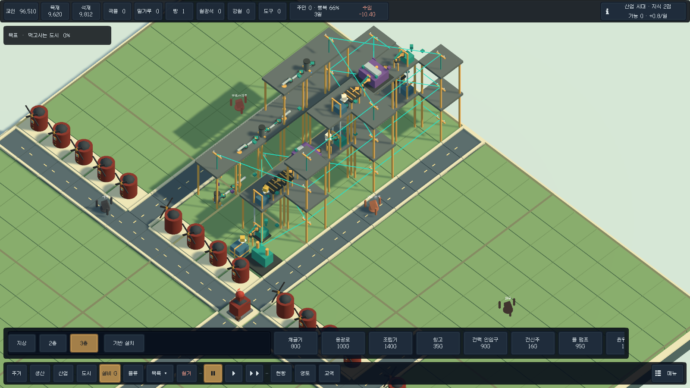

# RIVERWORKS

정착지를 먹이며, 벨트와 파이프로 공장을 잇는 로우폴리 도시 게임입니다.

[지금 받기 · Windows v0.27.0](https://github.com/atozuser0224/riverworks-city/releases/download/v0.27.0/Riverworks-v0.27.0-Windows-x64.zip) · [소개 페이지](https://atozuser0224.github.io/riverworks-city/) · [릴리스 기록](https://github.com/atozuser0224/riverworks-city/releases/tag/v0.27.0)


ZIP을 폴더째 풀고 `Riverworks.exe`를 실행합니다. Unity를 깔지 않아도 됩니다.

## 이 빌드에서 하는 일

- 야영지와 집, 채집으로 시작합니다. 주민은 도로를 걷고, 식량과 장작이 떨어지면 마을이 흔들립니다.
- 같은 지도 위에 벨트와 투입기, 파이프를 놓습니다. 고체와 유체를 나누고, 출구가 막히면 생산도 멈춥니다.
- 연구는 선행이 있는 트리입니다. 구리·석유·알루미늄을 부품으로 바꾸고, 층이 있는 공장과 조건 자동화까지 이어집니다.
- v0.27.0은 공장 생산과 생존에 집중합니다. 국가·대륙 캠페인, 전쟁 UI, Laya 모델 연동을 제거했습니다. 인구를 먹이고 공장 생산선을 증명한 뒤 제어 장치를 도시로 들여와 승리합니다.



## 조작

`B` 건설, `G` 설비, `T` 연구, `WASD` 카메라, `Q` `E` 회전. 처음이면 [플레이 안내](Docs/PLAYER_GUIDE.ko.md)를 보세요.

## 소스 상태

**v0.27.0은 Windows 실행 파일 배포입니다.** 이 저장소의 소스와 GitHub가 자동 제공하는 `Source code` 압축 파일은 아직 이전 v0.26.0 계열이며, v0.27.0 실행 파일을 재현하는 소스가 아닙니다. 소스를 이용할 때 버전 차이를 확인하세요.

## 이전 소스에서 빌드

Unity **6000.5.5f1**. 유료 패키지 Feel은 저장소에 없고, 본인 라이선스로 [설치 안내](Docs/FEEL_SETUP.ko.md)를 따른 뒤 엽니다.

```powershell
dotnet run --project .\Tests\Riverworks.Tests.csproj -c Release
```

이전 소스의 Windows 패키지 절차는 [릴리스 절차](Docs/RELEASE_PROCESS.ko.md)에 있습니다.
